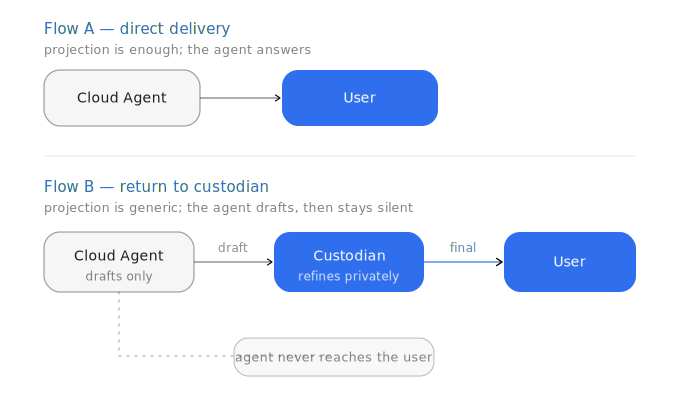
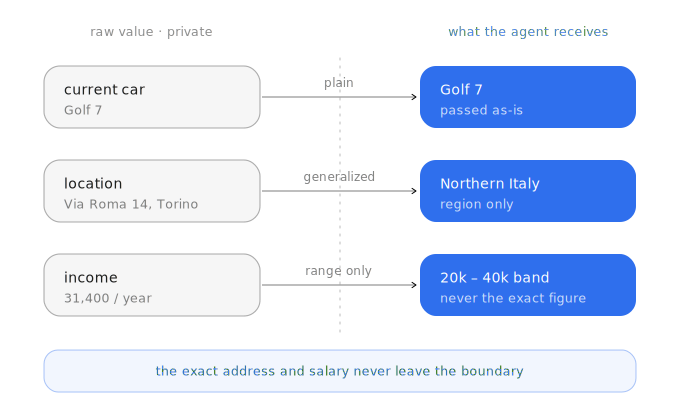

# Risk Attestation Protocol (RAP)

*🇬🇧 [Read in English](README.md)*

**Un protocollo per far lavorare un'AI cloud capace con i tuoi dati privati — senza mai darle i tuoi dati privati.**

Un modello cloud potente non legge mai il tuo contesto privato grezzo. Dichiara
invece *cosa pensa di aver bisogno e perché*, e un custode locale fidato — che gira
dove vivono i tuoi dati — esamina quella richiesta, decide cosa può attraversare il
confine e con quale granularità, e restituisce solo una proiezione approvata. Il
custode decide perfino se l'agente cloud può risponderti direttamente, oppure se
deve restituire il proprio lavoro per la rifinitura privata.

Tutta la negoziazione avviene attraverso un unico documento ispezionabile:
l'**attestato di rischio**.

## I due ruoli

- **Cloud Agent** — capace, non fidato. Gira su un grande modello cloud. Ti parla,
  ragiona, abbozza risposte. Non tocca mai i tuoi dati privati grezzi.
- **Private Custodian** — fidato. Gira dove vivono i tuoi dati. È l'unico che legge
  il contesto privato grezzo, e l'unica autorità su cosa viene rilasciato e se
  l'agente cloud può risponderti.

Non condividono mai memoria. L'attestato è l'unica cosa che attraversa il confine —
ogni campo nominato, classificato, e assegnato a una granularità di rilascio.

## Due flussi di consegna

Il custode decide, per ogni richiesta, se l'agente cloud può risponderti
direttamente o se deve restituire una bozza per la rifinitura privata.

Il Flusso B è ciò che rende il confine *utile* invece che solo restrittivo:
permette a un modello potente-ma-non-fidato di fare lavoro reale su una domanda che
non gli è permesso vedere per intero.

## Cosa significa "granularità di rilascio"

Ogni campo approvato attraversa il confine a una fedeltà fissa — `plain`,
`generalized`, `range_only`, `tokenized`, `summarized`, `redacted`, o `yes_no`.
L'agente cloud deve trattarli come limiti invalicabili.

Il modello cloud riceve abbastanza per fare buon lavoro — una regione, una fascia
di reddito — ma l'indirizzo esatto e lo stipendio esatto non lasciano mai il
confine.

## Leggi la specifica

Il protocollo completo — schema, campi obbligatori, modalità di rilascio,
l'invariante di sicurezza, e i criteri di conformità — è in **[SPEC.md](SPEC.md)**.
La specifica è in inglese (lingua canonica del protocollo).

Il razionale di design, incluso il perché lo scambio è deliberatamente testo in
chiaro e non un canale latente/opaco, e un resoconto onesto di cosa RAP *non*
protegge, è in **[WRITEUP.it.md](WRITEUP.it.md)** (versione italiana
dell'articolo).

## Stato

Bozza (v0.1.0). Il protocollo è neutro rispetto all'implementazione: chiunque
costruisca un agente che debba toccare dati privati senza cederli può implementare
i due ruoli e il documento che passa tra loro.

## Licenza

Specifica rilasciata sotto [CC BY-SA 4.0](LICENSE).
